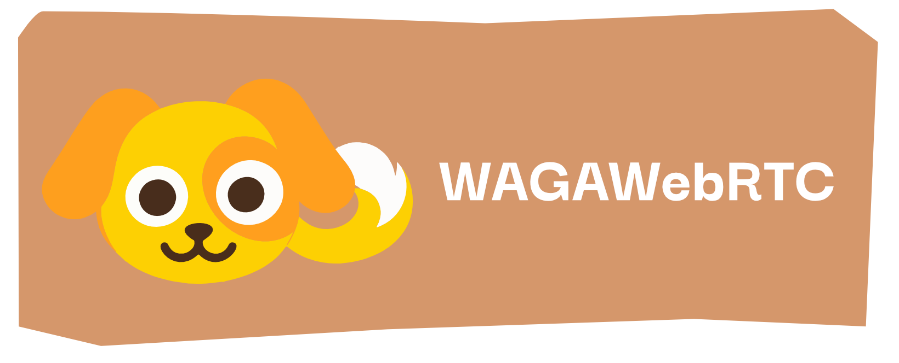

# WagaWebRTC

WagaWebRTC is a Swift framework built on the [str0m WebRTC library](https://github.com/algesten/str0m) for Rust. It publishes H.264 or H.265 video and Opus audio over WHIP, with optional experimental AAC publishing.

## Built on str0m

[str0m](https://github.com/algesten/str0m) provides the WebRTC core: SDP, ICE, DTLS, SRTP, RTP packetization, NACK, and RTCP. Its Sans I/O design leaves network operations to the application. WagaWebRTC adds the Swift/C bridge, per-interface UDP sockets through Network.framework, path selection, and shared-history packet recovery.

Credit to the str0m authors and contributors. We use a pinned copy of str0m 0.23.1 with a local experimental AAC patch; see the [patch notes](vendor/README.md). For the upstream library, see the [str0m repository](https://github.com/algesten/str0m) and [API documentation](https://docs.rs/str0m).

## Usage

The public surface is intentionally small:

```swift
let publisher = try WagaPublisher(
    audio: .opus,
    video: .h264,
    mode: .bonded,
    iceServers: ["stun:stun.l.google.com:19302"],
    targetBitrate: 3_500_000,
    delegate: delegate
)
publisher.createOffer { result in /* POST SDP to the WHIP endpoint */ }
publisher.acceptAnswer(answerSdp)
publisher.send(codec: .h264, mediaTime: timestamp90k, data: accessUnit)
```

Use `.bonded` with Wagastrim. It validates every ICE path, measures STUN RTT, and sends encrypted RTP/RTCP over the lowest-latency candidate that is not backed up, spilling onto another physical interface when needed. A shared 4096-packet history is available to every path. Wagastrim can request an exact encrypted packet from that history, and the retry is sent over the healthiest path at that moment instead of the path used originally. Use `.standard` for an ordinary WHIP service that only expects media on the nominated ICE pair.

Bonded publishing also sends one XOR parity datagram after each group of eight encrypted RTP packets. Wagastrim can reconstruct one missing audio or video packet once that parity arrives without waiting for a round trip. If a group loses more than one packet, it requests the remaining packets from the shared history. The parity overhead is about 12.5% of media traffic.

Set `targetBitrate` to enable transport-wide congestion control. The delegate receives bandwidth estimates through `wagaPublisherBitrateEstimate(_:)`; the publisher must lower its media encoder rate when that estimate falls.

The app owns HTTP signaling and encoding. Create one publisher or receiver per session and call `stop()` before releasing it. Delegate callbacks run on the peer's queue, not the main queue. Timestamps use codec clock ticks: 90 kHz for video, 48 kHz for audio (960 samples per 20 ms Opus packet, 1024 per AAC-LC frame).

## Local verification

The repository keeps Rust under `rust/` and exposes only a C ABI to Swift. A pinned str0m source copy under `vendor/` adds opt-in AAC-hbr transport; see `vendor/README.md` for the patch scope and limitations.

```sh
./scripts/verify-local.sh
```

## Local AAC recording test

Run `cargo run --example aac_ingest -- <LAN-IP> <random-token-at-least-24-characters> <new-output.aac>` on the Mac. The receiver prints a token-protected HTTP WHIP URL on port 8099. Use that URL in a separate Moblin test stream on the same Wi-Fi, select AAC at 128 kbps and H.264, and disable bonding. Allow local-network access if iOS asks.

This single-session test saves up to 60 seconds of AAC audio as ADTS (maximum 32 MiB); it does not provide video preview or forwarding. Stop it with Ctrl-C if unused. Do not expose this test receiver to the internet. The production WagaStrim preview still requires Opus.

Allow `aac_ingest` through the Mac firewall if prompted. After 60 seconds the receiver exits, so the phone's reconnect attempt will fail. Restart the command with a new output filename for another recording.

## iOS artifact

Requires full Xcode with Swift 6 and Rust installed through rustup. Select Xcode with `xcode-select`, then run:

```sh
./scripts/build-xcframework.sh
```

This produces `Artifacts/CWagaWebRTC.xcframework` for iPhone and simulator using str0m's Apple CryptoKit backend. `Package.swift` detects the artifact automatically, so the repository can be added to Moblin as one local Swift package. `WagaPublisher` handles outgoing WHIP; `WagaReceiver` handles WHEP and incoming WHIP offers.

Build the artifact before adding the local package to Xcode. Prebuilt binaries are not included. Scripts use your existing Rust installation; `WAGA_TOOLCHAIN_DIR` optionally selects a directory containing `rustup/` and `cargo/`.

## Scope

- Host and STUN server-reflexive ICE candidates over UDP are supported on each active interface.
- H.264 and H.265 access units may use VideoToolbox's AVCC length prefixes or Annex B start codes.
- TURN is not implemented. Opus remains the default audio codec. Experimental AAC publishing uses 48 kHz stereo and requires a receiver that accepts MPEG4-GENERIC/AAC-hbr. Start at 128 kbps. WagaStrim's browser preview still requires Opus.
- Bonding distributes original packets rather than duplicating them. XOR parity and history-based repair provide loss recovery; SRTP sequence numbers provide ordering and Wagastrim's receive side deduplicates retransmissions.
- An iPhone cannot expose two independent cellular data interfaces to one app merely because two eSIMs are installed. The framework bonds every interface iOS actually exposes, normally one cellular path plus Wi-Fi and Ethernet.

Rust transport tests, Swift codec/path/recovery tests and a one-minute iPhone AAC recording have passed locally. This is experimental: long-session stability, battery use and AAC under impaired bonded links have not been verified.

## License

WagaWebRTC's own code is licensed under [MIT](LICENSE). Vendored str0m and other dependencies retain their own licenses and copyright notices; see [vendor/](vendor/).
